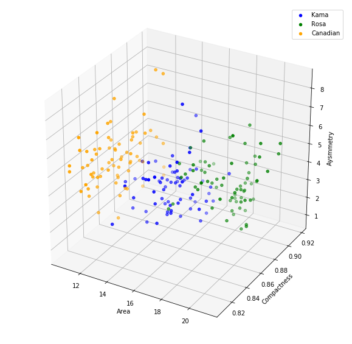

# Projeto Prático 4

### Alunos:
- <a href="https://github.com/manoel-victor1602">Manoel Victor Florencio de Souza</a>
- <a href="https://github.com/SergioPinheiro">Sérgio Alexandre Arruda Pinheiro</a>

### Base de Dados:

A base de dados usada pode ser encontrada no Kaggle através do link: 
https://www.kaggle.com/rwzhang/seeds-dataset


```python
%pylab inline
import numpy as np
import pandas as pd

from sklearn.neural_network import MLPClassifier
from sklearn.model_selection import GridSearchCV

from math import sqrt
from math import ceil

from mpl_toolkits.mplot3d import Axes3D

import warnings
```

    Populating the interactive namespace from numpy and matplotlib
    


```python
warnings.simplefilter("ignore")
```

# 1. Carregamento e Análise do Conjunto de Dados


```python
names = ['area','perimeter','compactness','length','width','asymmetry','groove','type']
```


```python
df = pd.read_csv('seeds_dataset.txt', '\t', names=names)
df['type'] = df['type'].map({1:'Kama', 2:'Rosa', 3:'Canadian'})
```


```python
df.corr()
```


<div>
<table border="1" class="dataframe">
  <thead>
    <tr style="text-align: right;">
      <th></th>
      <th>area</th>
      <th>perimeter</th>
      <th>compactness</th>
      <th>length</th>
      <th>width</th>
      <th>asymmetry</th>
      <th>groove</th>
    </tr>
  </thead>
  <tbody>
    <tr>
      <th>area</th>
      <td>1.000000</td>
      <td>0.994341</td>
      <td>0.608288</td>
      <td>0.949985</td>
      <td>0.970771</td>
      <td>-0.229572</td>
      <td>0.863693</td>
    </tr>
    <tr>
      <th>perimeter</th>
      <td>0.994341</td>
      <td>1.000000</td>
      <td>0.529244</td>
      <td>0.972422</td>
      <td>0.944829</td>
      <td>-0.217340</td>
      <td>0.890784</td>
    </tr>
    <tr>
      <th>compactness</th>
      <td>0.608288</td>
      <td>0.529244</td>
      <td>1.000000</td>
      <td>0.367915</td>
      <td>0.761635</td>
      <td>-0.331471</td>
      <td>0.226825</td>
    </tr>
    <tr>
      <th>length</th>
      <td>0.949985</td>
      <td>0.972422</td>
      <td>0.367915</td>
      <td>1.000000</td>
      <td>0.860415</td>
      <td>-0.171562</td>
      <td>0.932806</td>
    </tr>
    <tr>
      <th>width</th>
      <td>0.970771</td>
      <td>0.944829</td>
      <td>0.761635</td>
      <td>0.860415</td>
      <td>1.000000</td>
      <td>-0.258037</td>
      <td>0.749131</td>
    </tr>
    <tr>
      <th>asymmetry</th>
      <td>-0.229572</td>
      <td>-0.217340</td>
      <td>-0.331471</td>
      <td>-0.171562</td>
      <td>-0.258037</td>
      <td>1.000000</td>
      <td>-0.011079</td>
    </tr>
    <tr>
      <th>groove</th>
      <td>0.863693</td>
      <td>0.890784</td>
      <td>0.226825</td>
      <td>0.932806</td>
      <td>0.749131</td>
      <td>-0.011079</td>
      <td>1.000000</td>
    </tr>
  </tbody>
</table>
</div>


Ao analisar a matriz de correlação entre todas as variáveis da base de dados tem-se que os atributos *Area, Perimeter, Length, Width e Groove* possuem uma correlação positiva superior a 0.86 o que mostra que um atributo representa quase completamente os outros. Com isso, foi escolhido por deixar o atributo *Area* e retirar os demais, assim ficamos com 3 atributos preditores *Area, Compactness* e *Asymmetry*.


```python
df = df.drop(['perimeter', 'length','width','groove'], axis=1)
X = df.iloc[:,:-1]
y = df.iloc[:,-1]
df.corr()
```


<div>
<table border="1" class="dataframe">
  <thead>
    <tr style="text-align: right;">
      <th></th>
      <th>area</th>
      <th>compactness</th>
      <th>asymmetry</th>
    </tr>
  </thead>
  <tbody>
    <tr>
      <th>area</th>
      <td>1.000000</td>
      <td>0.608288</td>
      <td>-0.229572</td>
    </tr>
    <tr>
      <th>compactness</th>
      <td>0.608288</td>
      <td>1.000000</td>
      <td>-0.331471</td>
    </tr>
    <tr>
      <th>asymmetry</th>
      <td>-0.229572</td>
      <td>-0.331471</td>
      <td>1.000000</td>
    </tr>
  </tbody>
</table>
</div>


Aqui vemos que a correlação entre as variáveis restantes não supera 0.65 positivamente, nem 0.34 negativamente.


```python
df_kama = df[df.type == 'Kama']
df_canadian = df[df.type == 'Canadian']
df_rosa = df[df.type == 'Rosa']
```


```python
fig = plt.figure(figsize=(10,10))
ax = fig.add_subplot(1, 1, 1, projection='3d')
 
ax.scatter(df_kama.area, df_kama.compactness, df_kama.asymmetry, c='blue', label='Kama')
ax.scatter(df_rosa.area, df_rosa.compactness, df_rosa.asymmetry, c='green', label='Rosa')
ax.scatter(df_canadian.area, df_canadian.compactness, df_canadian.asymmetry, c='orange', label='Canadian')

ax.set_xlabel('Area')
ax.set_ylabel('Compactness')
ax.set_zlabel('Aysmmetry')

plt.legend()
```


 





A partir da análise do gráfico de dispersão acima, é possível notar que apenas as 3 variáveis selecionadas já apresentam uma separação clara entre as 3 classes.

# 2. Função Pirâmide, Parâmetros e Hiperparâmetros

A função **piramid()** retorna uma lista de tuplas contendo todas as possíveis combinações de neurônios aceitáveis pelo parâmetro **hidden_layer_sizes**  de acordo com a regra da piramide geométrica:


```python
def piramid(alpha=2, n_in=7, n_out=1):
    neurons = ceil(alpha * sqrt(n_in * n_out))
    ret = [(neurons,)]
    ret += [(neurons-n, n) for n in range(1, neurons)]
    return ret
```

Conjunto de parâmetros que irão constituir o *GridSearchCV*


```python
params = {
    'activation': ['logistic', 'relu', 'tanh', 'identity'], 
    'max_iter': [200, 400, 600],
    'learning_rate_init': [0.001, 0.003, 0.01, 0.0005],
    'hidden_layer_sizes': list(piramid(alpha=0.5, n_in=3) + piramid(alpha=2, n_in=3) + piramid(alpha=3, n_in=3))
}
```


```python
params
```


    {'activation': ['logistic', 'relu', 'tanh', 'identity'],
     'max_iter': [200, 400, 600],
     'learning_rate_init': [0.001, 0.003, 0.01, 0.0005],
     'hidden_layer_sizes': [(1,),
      (4,),
      (3, 1),
      (2, 2),
      (1, 3),
      (6,),
      (5, 1),
      (4, 2),
      (3, 3),
      (2, 4),
      (1, 5)]}


# 3. Definição do GridSearchCV


```python
clf = GridSearchCV(MLPClassifier(solver='lbfgs'), params, scoring='accuracy', cv=3, n_jobs=-1)
```

Por problemas decorridos em sala e sugestão da professora, a métrica a ser usada para avaliar o modelo foi a acurácia.

O solver *lbfgs* foi escolhido pois é o que melhor se adequa em relação ao número de exemplos na base de dados do problema (210) e de acordo com a documentação do sklearn "Para pequenas bases de dados, *lbfgs* converge mais rapidamente e obtém melhor performance"¹.

Referência: http://scikit-learn.org/stable/modules/generated/sklearn.neural_network.MLPClassifier.html ¹

# 4. Treinamento dos Modelos


```python
clf.fit(X, y)
```


    GridSearchCV(cv=3, error_score='raise',
           estimator=MLPClassifier(activation='relu', alpha=0.0001, batch_size='auto', beta_1=0.9,
           beta_2=0.999, early_stopping=False, epsilon=1e-08,
           hidden_layer_sizes=(100,), learning_rate='constant',
           learning_rate_init=0.001, max_iter=200, momentum=0.9,
           nesterovs_momentum=True, power_t=0.5, random_state=None,
           shuffle=True, solver='lbfgs', tol=0.0001, validation_fraction=0.1,
           verbose=False, warm_start=False),
           fit_params={}, iid=True, n_jobs=-1,
           param_grid={'activation': ['logistic', 'relu', 'tanh', 'identity'], 'max_iter': [200, 400, 600], 'learning_rate_init': [0.001, 0.003, 0.01, 0.0005], 'hidden_layer_sizes': [(1,), (4,), (3, 1), (2, 2), (1, 3), (6,), (5, 1), (4, 2), (3, 3), (2, 4), (1, 5)]},
           pre_dispatch='2*n_jobs', refit=True, return_train_score=True,
           scoring='accuracy', verbose=0)


# 5. Resultados Encontrados


```python
print(clf.best_score_)
print(clf.best_params_)
```

    0.9095238095238095
    {'activation': 'identity', 'hidden_layer_sizes': (2, 2), 'learning_rate_init': 0.01, 'max_iter': 600}
    


```python
best_params = clf.best_params_
```

- 4 funções de ativação

- 3 números de épocas

- 4 taxas de aprendizado

- 11 configurações de camadas ocultas encontradas a partir da função pirâmide

4 x 3 x 4 x 11 = 528 Classificadores


```python
print('Foram criados 528 Classificadores e comparados entre si usando a métrica da acurácia para descobrir o melhor modelo, ao final foi encontrado a melhor configuração, tal que possui a função de ativação {}, com o número de neurônios nas camadas ocultas sendo de {}, taxa de aprendizado de {} e {} épocas.'.format(best_params['activation'], best_params['hidden_layer_sizes'], best_params['learning_rate_init'], best_params['max_iter']))
```

    Foram criados 528 Classificadores e comparados entre si usando a métrica da acurácia para descobrir o melhor modelo, ao final foi encontrado a melhor configuração, tal que possui a função de ativação identity, com o número de neurônios nas camadas ocultas sendo de (2, 2), taxa de aprendizado de 0.01 e 600 épocas.
    
